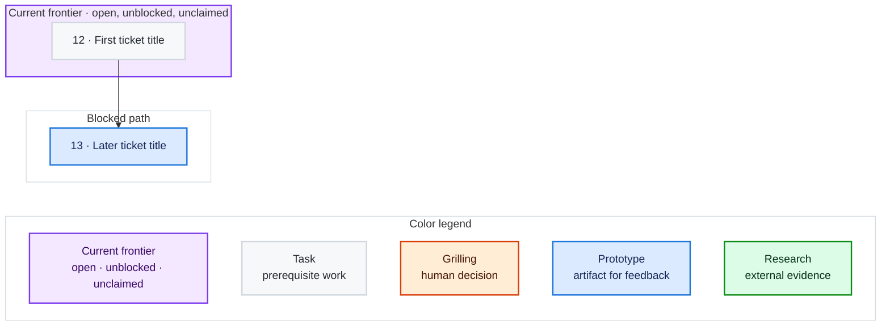

# GitHub issue conventions

Use native GitHub issue relationships and a stable label palette so hierarchy and work state remain visible in issue lists and planning tools.

## Wayfinder hierarchy

- A Wayfinder map is a parent issue labelled `wayfinder:map`.
- Each session-sized ticket is an existing or newly created sub-issue of its map.
- Convert an existing issue in place; do not recreate it:

  ```bash
  gh issue edit <child> --parent <map>
  ```

- Several children can be attached from the parent:

  ```bash
  gh issue edit <map> --add-sub-issue <child>,<child>
  ```

- Prefer native sub-issues. Only when unavailable, put a linked `Parent` section in the child body.
- Use native issue dependencies for blocking. Body-level `Blocked by` links are fallback metadata only.
- Preserve one direct parent per ticket. Use deeper nesting only when it represents a real deliverable hierarchy.

## Wayfinder dependency maps

The map body carries a `## Dependency graph` Mermaid block as its live, low-resolution index of open child tickets. Keep it as the only open-ticket summary; decisions remain in their tickets.

- **Chart:** after ticket IDs exist and dependencies are wired, create the graph.
- **Refresh:** immediately after a claim, then after any ticket status, assignee, or dependency change, rebuild from tracker data and recompute the frontier.
- Use `flowchart TB`. Include each open child once as `<issue number> · <ticket title>` and link it to the ticket; names stay primary and numbers ride alongside them.
- Draw every arrow from blocker to blocked ticket. Derive edges from native issue dependencies, or the documented `Blocked by:` fallback where native dependencies are unavailable.
- Separate `Current frontier · open, unblocked, unclaimed` from the blocked path. Put claimed-but-unblocked tickets in a separate `Claimed · assigned` group when present; they are neither frontier nor blocked.
- Color ticket nodes by their `wayfinder:<type>` label using the [Wayfinder label palette](#wayfinder-labels). Use a purple frontier outline and legend swatch (`#F3E8FF` fill, `#7C3AED` stroke, `#3B0764` text), distinct from every ticket type.
- Keep a visible in-chart legend for frontier, task, grilling, prototype, and research. Include research even when the graph has no research ticket.

Use this scaffold, repeating ticket nodes, edges, links, and class assignments as needed:



## Wayfinder labels

| Label | Meaning | Color |
|---|---|---|
| `wayfinder:map` | Canonical Wayfinder map | Teal `#006B75` |
| `wayfinder:research` | Evidence-gathering ticket; suitable for AFK work | Green `#0E8A16` |
| `wayfinder:grilling` | Decision ticket requiring maintainer attention | Orange `#D93F0B` |
| `wayfinder:prototype` | Throwaway test of an approach | Blue `#1D76DB` |
| `wayfinder:task` | Execution of settled work | Light gray `#D0D7DE` |

## Triage labels

| Label | Meaning | Color |
|---|---|---|
| `needs-triage` | Maintainer needs to evaluate the issue | Yellow `#FBCA04` |
| `needs-info` | Waiting for more information | Pale orange `#F9D0C4` |
| `ready-for-agent` | Fully specified and ready for an AFK agent | Green `#0E8A16` |
| `ready-for-human` | Requires human implementation or judgment | Deep red `#B60205` |
| `wontfix` | Will not be actioned | White `#FFFFFF` |

Matching colors may encode related handling: research and `ready-for-agent` are green because both suit AFK execution. Grilling and `ready-for-human` use attention colors while remaining distinct.

## Applying the palette

Create missing labels or refresh existing labels with `gh label create --force`:

```bash
gh label create 'wayfinder:map'       --color '006B75' --description 'Canonical Wayfinder map' --force
gh label create 'wayfinder:research'  --color '0E8A16' --description 'Wayfinder research ticket' --force
gh label create 'wayfinder:grilling'  --color 'D93F0B' --description 'Wayfinder decision ticket requiring maintainer attention' --force
gh label create 'wayfinder:prototype' --color '1D76DB' --description 'Wayfinder prototype ticket' --force
gh label create 'wayfinder:task'      --color 'D0D7DE' --description 'Wayfinder execution task' --force
gh label create 'needs-triage'        --color 'FBCA04' --description 'Maintainer needs to evaluate this issue' --force
gh label create 'needs-info'          --color 'F9D0C4' --description 'Waiting for more information' --force
gh label create 'ready-for-agent'     --color '0E8A16' --description 'Fully specified and ready for an AFK agent' --force
gh label create 'ready-for-human'     --color 'B60205' --description 'Requires human implementation or judgment' --force
gh label create 'wontfix'             --color 'FFFFFF' --description 'Will not be actioned' --force
```

Leave GitHub's other default labels and colors unchanged.
